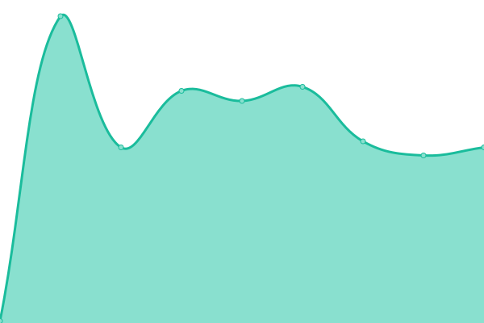

# [📈 Live Status](https://status.scriptor-artis.fr): <!--live status--> **Tous les sytèmes sont opérationnels**

This repository contains the open-source uptime monitor and status page for [Upptime](https://upptime.js.org), powered by [Upptime](https://github.com/upptime/upptime).

With [Upptime](https://upptime.js.org), you can get your own unlimited and free uptime monitor and status page, powered entirely by a GitHub repository. We use [Issues](https://github.com/upptime/upptime/issues) as incident reports, [Actions](https://github.com/xonlly/status.scriptor-artis.fr/actions) as uptime monitors, and [Pages](https://status.scriptor-artis.fr) for the status page.

<!--start: status pages-->
<!-- This summary is generated by Upptime (https://github.com/upptime/upptime) -->
<!-- Do not edit this manually, your changes will be overwritten -->
<!-- prettier-ignore -->
| URL | Status | History | Response Time | Uptime |
| --- | ------ | ------- | ------------- | ------ |
|  [Scriptor-artis Website](https://www.scriptor-artis.com) | Opérationnel | [scriptor-artis-website.yml](https://github.com/Scriptor-Group/status/commits/HEAD/history/scriptor-artis-website.yml) | 

 899ms
     
 | 

<a href="https://status.scriptor-artis.fr/history/scriptor-artis-website">100.00%</a>
    

|  [Clavus API](https://api-v2.clavus.io/health) | Opérationnel | [clavus-api.yml](https://github.com/Scriptor-Group/status/commits/HEAD/history/clavus-api.yml) | 

 516ms
     
 | 

<a href="https://status.scriptor-artis.fr/history/clavus-api">100.00%</a>
    

|  [Clavus Website (Public 1)](https://www.clavus.io) | Opérationnel | [clavus-website-public-1.yml](https://github.com/Scriptor-Group/status/commits/HEAD/history/clavus-website-public-1.yml) | 

 1766ms
     
 | 

<a href="https://status.scriptor-artis.fr/history/clavus-website-public-1">99.82%</a>
    

|  [Clavus Website (Public 1)](https://tzar.clavus.cloud) | Opérationnel | [clavus-website-public-1.yml](https://github.com/Scriptor-Group/status/commits/HEAD/history/clavus-website-public-1.yml) | 

 1766ms
     
 | 

<a href="https://status.scriptor-artis.fr/history/clavus-website-public-1">99.82%</a>
    

|  Clavus Website (C1) | Opérationnel | [clavus-website-c1.yml](https://github.com/Scriptor-Group/status/commits/HEAD/history/clavus-website-c1.yml) | 

 1774ms
     
 | 

<a href="https://status.scriptor-artis.fr/history/clavus-website-c1">99.83%</a>
    

|  Clavus Website (C2) | Opérationnel | [clavus-website-c2.yml](https://github.com/Scriptor-Group/status/commits/HEAD/history/clavus-website-c2.yml) | 

 1693ms
     
 | 

<a href="https://status.scriptor-artis.fr/history/clavus-website-c2">99.85%</a>
    

|  [Whitemark systems](http://wm.clavus.io/) | Opérationnel | [whitemark-systems.yml](https://github.com/Scriptor-Group/status/commits/HEAD/history/whitemark-systems.yml) | 

 224ms
     
 | 

<a href="https://status.scriptor-artis.fr/history/whitemark-systems">100.00%</a>
    

|  [Tzar Website](https://www.tzar.fr) | Opérationnel | [tzar-website.yml](https://github.com/Scriptor-Group/status/commits/HEAD/history/tzar-website.yml) | 

 1308ms
     
 | 

<a href="https://status.scriptor-artis.fr/history/tzar-website">99.93%</a>
    

|  [Tzar API](https://api.tzar.fr/health) | Opérationnel | [tzar-api.yml](https://github.com/Scriptor-Group/status/commits/HEAD/history/tzar-api.yml) | 

 1129ms
     
 | 

<a href="https://status.scriptor-artis.fr/history/tzar-api">99.93%</a>
    

|  [SMTP 1 (clavus.io)](163.172.93.27) | Opérationnel | [smtp-1-clavus-io.yml](https://github.com/Scriptor-Group/status/commits/HEAD/history/smtp-1-clavus-io.yml) | 

 113ms
     
 | 

<a href="https://status.scriptor-artis.fr/history/smtp-1-clavus-io">100.00%</a>
    

|  [SMTP 2 (private)](163.172.44.120) | Opérationnel | [smtp-2-private.yml](https://github.com/Scriptor-Group/status/commits/HEAD/history/smtp-2-private.yml) | 

 113ms
     
 | 

<a href="https://status.scriptor-artis.fr/history/smtp-2-private">100.00%</a>
    

|  [Office A](https://office-a.clavus.io/welcome/) | Opérationnel | [office-a.yml](https://github.com/Scriptor-Group/status/commits/HEAD/history/office-a.yml) | 

 594ms
     
 | 

<a href="https://status.scriptor-artis.fr/history/office-a">100.00%</a>
    

|  [Office B](https://office-b.clavus.io/welcome/) | Opérationnel | [office-b.yml](https://github.com/Scriptor-Group/status/commits/HEAD/history/office-b.yml) | 

 607ms
     
 | 

<a href="https://status.scriptor-artis.fr/history/office-b">100.00%</a>
    

|  [Meet (visio)](https://meet.clavus.io/) | Opérationnel | [meet-visio.yml](https://github.com/Scriptor-Group/status/commits/HEAD/history/meet-visio.yml) | 

 741ms
     
 | 

<a href="https://status.scriptor-artis.fr/history/meet-visio">100.00%</a>
    

|  [Webmail 1](https://webmail.clavus.io) | Opérationnel | [webmail-1.yml](https://github.com/Scriptor-Group/status/commits/HEAD/history/webmail-1.yml) | 

 947ms
     
 | 

<a href="https://status.scriptor-artis.fr/history/webmail-1">99.49%</a>
    

|  P1 Server | Opérationnel | [p1-server.yml](https://github.com/Scriptor-Group/status/commits/HEAD/history/p1-server.yml) | 

 114ms
     
 | 

<a href="https://status.scriptor-artis.fr/history/p1-server">100.00%</a>
    

|  P2 Server | Opérationnel | [p2-server.yml](https://github.com/Scriptor-Group/status/commits/HEAD/history/p2-server.yml) | 

 115ms
     
 | 

<a href="https://status.scriptor-artis.fr/history/p2-server">100.00%</a>
    

|  P3 Server | Opérationnel | [p3-server.yml](https://github.com/Scriptor-Group/status/commits/HEAD/history/p3-server.yml) | 

 115ms
     
 | 

<a href="https://status.scriptor-artis.fr/history/p3-server">100.00%</a>
    

|  [Devana.ai Website](https://www.devana.ai) | Opérationnel | [devana-ai-website.yml](https://github.com/Scriptor-Group/status/commits/HEAD/history/devana-ai-website.yml) | 

 1025ms
     
 | 

<a href="https://status.scriptor-artis.fr/history/devana-ai-website">100.00%</a>
    

<!--end: status pages-->

[**Visit our status website →**](https://status.scriptor-artis.fr)

## 📄 License

- Powered by: [Upptime](https://github.com/upptime/upptime)
- Code: [MIT](./LICENSE) © [Upptime](https://upptime.js.org)
- Data in the `./history` directory: [Open Database License](https://opendatacommons.org/licenses/odbl/1-0/)
